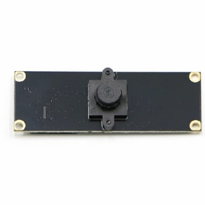
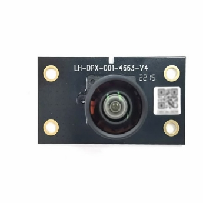
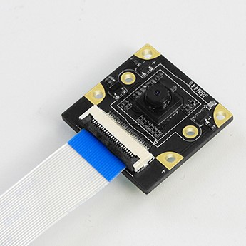
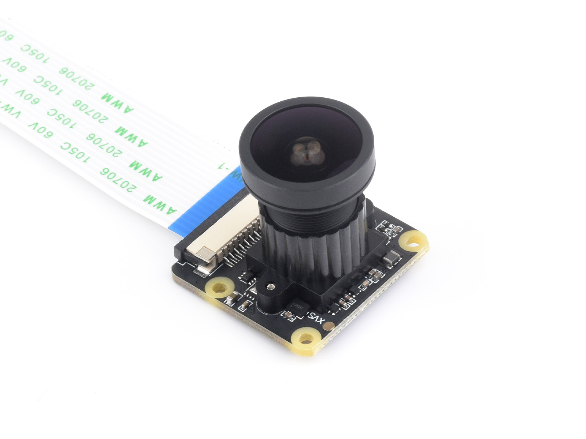
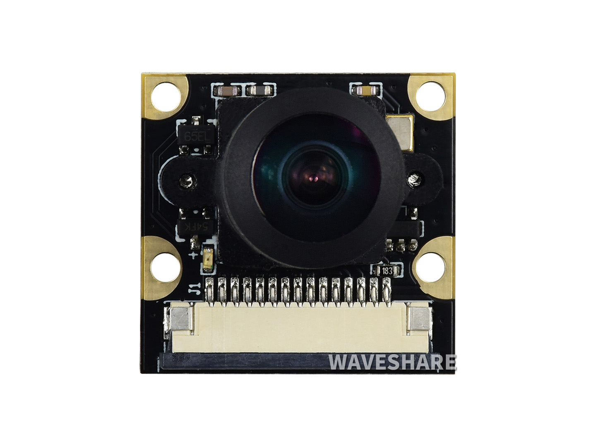
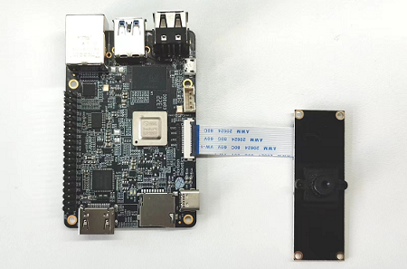
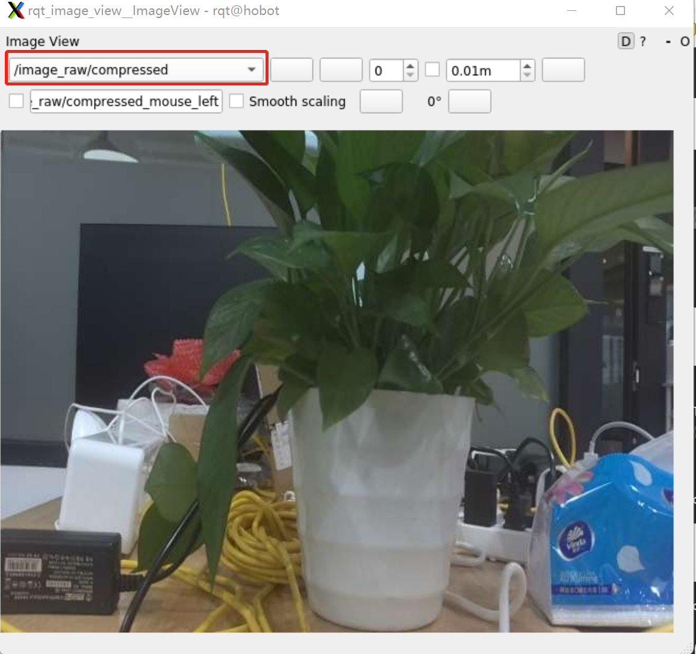
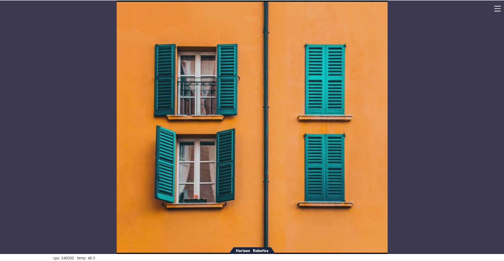
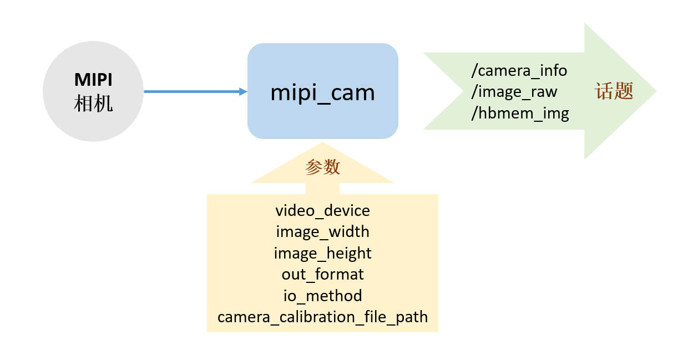

English| [简体中文](./README_cn.md)

# Function Introduction

Configure the MIPI interface camera that has been adapted, and publish the collected image data in the form of ROS standard image messages or zero-copy (hbmem) image messages for other modules that need to use image data to subscribe to.

# Bill of Materials

Currently supported MIPI cameras

| Index | Name    | Representational Image                     | Parameters     | Reference Link                                                |
| ----- | ------- | ------------------------------------------ | -------------- | ------------------------------------------------------------- |
| 1    | F37    |        | 200W Pixel | RDK X3, RDK X3 Module | [F37](https://detail.tmall.com/item.htm?abbucket=12&id=683310105141&ns=1&spm=a230r.1.14.28.1dd135f0wI2LwA&skuId=4897731532963) |
| 2    | GC4663 |  | 400W Pixel | RDK X3, RDK X3 Module | [GC4663](https://detail.tmall.com/item.htm?abbucket=12&id=683310105141&ns=1&spm=a230r.1.14.28.1dd135f0wI2LwA&skuId=4897731532963) |
| 3    | IMX219 |  | 800W Pixel | RDK X3, RDK X3 Module, RDK Ultra, RDK X5 | [IMX219](https://detail.tmall.com/item.htm?abbucket=9&id=710344235988&rn=259e73f46059c2e6fc9de133ba9ddddf&spm=a1z10.5-b-s.w4011-22651484606.159.55df6a83NWrGPi) |
| 4    | IMX477 |  | 200W Pixel | RDK X3, RDK X3 Module | [IMX477](https://www.waveshare.net/shop/IMX477-160-12.3MP-Camera.htm) |
| 5    | OV5647 |  | 200W Pixel | RDK X3, RDK X3 Module, RDK X5 | [OV5647](https://www.waveshare.net/shop/RPi-Camera-G.htm) |

# Usage

## Hardware Connection

Taking the F37 camera as an example, the connection method with RDK X3 is as follows:



## Function Installation

Run the following commands in the terminal of the RDK system to quickly install:

tros foxy:
```bash
sudo apt update
sudo apt install -y tros-mipi-cam
```

tros humble:
```bash
sudo apt update
sudo apt install -y tros-humble-mipi-cam
```

## Start Camera

Run the following commands in the terminal of the RDK system to use the default camera configuration and adaptively start the connected camera:

tros foxy:
```bash
# Configure the tros.b environment:
source /opt/tros/setup.bash
# Launch to start
ros2 launch mipi_cam mipi_cam.launch.py
```

tros humble:
```bash
# Configure the tros.b humble environment:
source /opt/tros/humble/setup.bash
# Launch to start
ros2 launch mipi_cam mipi_cam.launch.py
```

mipi_cam.launch.py configures the default output of 960*544 resolution NV12 image, and the topic name published is /hbmem_img.

If you need to use other resolutions or image formats, you can use the corresponding launch file, such as:- mipi_cam_640x480_bgr8.launch.py provides image data with a resolution of 640*480, in BGR8 format
- mipi_cam_640x480_bgr8_hbmem.launch.py provides zero-copy transmission image data with a resolution of 640*480, in BGR8 format
- mipi_cam_640x480_nv12_hbmem.launch.py provides zero-copy transmission image data with a resolution of 640*480, in NV12 format

If the program outputs the following information, it indicates that the node has started successfully

```text
[INFO] [launch]: All log files can be found below /root/.ros/log/2022-06-11-15-16-13-641715-ubuntu-8852
[INFO] [launch]: Default logging verbosity is set to INFO
[INFO] [mipi_cam-1]: process started with pid [8854]
...
```

## Image Visualization

### Using ROS rqt_image_view

Here, image visualization is achieved using the rqt_image_view in ROS2 Humble version installed on the PC side. Since raw data is being published, encoding the data into JPEG images can improve transmission efficiency. Open another terminal to subscribe to MIPI data and encode it as JPEG.

#### tros foxy
```shell
source /opt/tros/setup.bash
ros2 launch hobot_codec hobot_codec_encode.launch.py codec_out_format:=jpeg codec_pub_topic:=/image_raw/compressed
```

Ensure that the PC and RDK X3 are on the same network segment. For the Foxy version, execute the following command on the PC:

```shell
# Set up ROS2 environment
source /opt/ros/foxy/local_setup.bash
ros2 run rqt_image_view rqt_image_view
```

#### tros humble
```shell
source /opt/tros/humble/setup.bash
ros2 launch hobot_codec hobot_codec_encode.launch.py codec_out_format:=jpeg codec_pub_topic:=/image_raw/compressed
```

Ensure that the PC and RDK X3 are on the same network segment. For the humble version, execute the following command on the PC:

```shell
# Set up ROS2 environment
source /opt/ros/humble/local_setup.bash
ros2 run rqt_image_view rqt_image_view
```

Select the topic /image_raw/compressed to view the image as shown below:



### Using a Web Browser

Here, image visualization is achieved through a web interface. Since raw data is published, encoding the data into JPEG images is necessary. Open two separate terminals: one for subscribing to MIPI data and encoding it as JPEG, and another for publishing the webservice.

#### tros foxy
Open a new terminal
```shell
source /opt/tros/local_setup.bash
# Start encoding
ros2 launch hobot_codec hobot_codec_encode.launch.py
```
Open another terminal
```shell
source /opt/tros/local_setup.bash
# Start the websocket
ros2 launch websocket websocket.launch.py websocket_image_topic:=/image_jpeg websocket_only_show_image:=true
```

#### tros humble
Open a new terminal
```shell
source /opt/tros/humble/local_setup.bash
# Start encoding
ros2 launch hobot_codec hobot_codec_encode.launch.py
```
Open another terminal
```shell
source /opt/tros/humble/local_setup.bash
# Start the websocket
ros2 launch websocket websocket.launch.py websocket_image_topic:=/image_jpeg websocket_only_show_image:=true
```

Open a browser (chrome/firefox/edge) on your PC and enter <http://IP:8000> (where IP is the RDK IP address), then click on the Web display in the top left corner to see the real-time image output by the MIPI camera.
    


# Interface Explanation



## Topics

### Published Topics
| Name         | Message Type                          | Description                                      |
| ------------ | ------------------------------------ | ------------------------------------------------ |
| /camera_info | sensor_msgs/msg/CameraInfo           | Camera intrinsic topic, published based on the camera calibration file settings |
| /image_raw   | sensor_msgs/msg/Image                | Periodically published image topic, in rgb8 format |
| /hbmem_img   | rcl_interfaces/msg/HobotMemoryCommon | Image topic based on shared memory (share mem)    |

### Dual camera published Topics

| 名称         | 消息类型                             | 说明                                     |
| ------------ | ------------------------------------ | ---------------------------------------- |
| /camera_left_info | sensor_msgs/msg/CameraInfo           | Left camera intrinsic topic, published based on the camera calibration file settings  |
| /camera_right_info | sensor_msgs/msg/CameraInfo           | Right Camera intrinsic topic, published based on the camera calibration file settings  |
| /image_left_raw   | sensor_msgs/msg/Image                |   Left camera periodically published image toplic, in rgb8 format  |
| /image_right_raw   | sensor_msgs/msg/Image                |   Right camera periodically published image topic, in rgb8 format  |
| /image_combine_raw   | sensor_msgs/msg/Image                |Combine camera periodically published image topic, in rgb8 format   |
| /hbmem_left_img   | rcl_interfaces/msg/HobotMemoryCommon |  Image topic based on shared memory (share mem), left camera   |
| /hbmem_right_img   | rcl_interfaces/msg/HobotMemoryCommon |  Image topic based on shared memory (share mem), right camera      |
| /hbmem_combine_img   | rcl_interfaces/msg/HobotMemoryCommon |  Image topic based on shared memory (share mem), combine camera      |

## Parameters

| Name                         | Parameter Values                                | Description                                           |
| ---------------------------- | ----------------------------------------------- | ------------------------------------------------------ |
| video_device                 | Auto (default)<br />F37<br />GC4663<br />IMX415 | Camera device number, supports adaptive adaptation     |
| image_width                  | 1920 (default)                                  | Relevant to the camera used                             |
| image_height                 | 1080 (default)                                  | Relevant to the camera used                             |
| out_format                   | bgr8 (default)<br />nv12                        | Image encoding method                                  |
| io_method                    | None (default)<br />shared_mem                  | Image transfer method, enabling shared_mem will use zero-copy mechanism for transfer |
| camera_calibration_file_path | None (default)                                  | Path to the camera calibration file                     |
| device_mode                  | single（default）<br />single<br />dual         | device mode is single or dual                    |
| dual_combine                   | 0（default）<br />1 <br />2              | When device_mode_ == "dual" is effective, 0: publish left and right image;1: publish left, right and combine images;2: only publish combine image                              |
| channel                      | 0（default）                                      | mipi host number,rang 0~3                          |
| channel2                      | 2（default）                                 | When device_mode_ == "dual" is effective, mipi_host number of the right camera          |
| gdc_bin_file                   | None（default）                                 | Path to the GDC file                          |


# FAQ

1. Do I need to set different video_device parameters for different cameras?

    No, this Node supports camera adaptation. If you use the camera models listed in the "Supported Cameras" section, it will automatically adapt at runtime.

2. Notes on plugging and unplugging the camera:

    **It is strictly forbidden to plug or unplug the camera module without powering off the development board, as it can easily damage the camera module.**

3. If encountering abnormal startup of the hobot_sensor node, follow these steps for troubleshooting:
    - Check the hardware connections
    - Confirm the tros.b environment settings
    - Verify the parameters, refer to Hobot_Sensors README.md for specifics

4. If the PC-side ros2 topic list does not recognize the camera topics, troubleshoot as follows:- Check if the RDK is publishing images normally


     tros foxy:
      ```shell
      source /opt/tros/setup.bash
      ros2 topic list
      ```

     tros humble:
      ```shell
      source /opt/tros/humble/setup.bash
      ros2 topic list
      ```

      Output:

      ```text
      /camera_info
      /hbmem_img000b0c26001301040202012020122406
      /image_raw
      /image_raw/compressed
      /parameter_events
      /rosout
      ```

   - Check if the PC can ping the RDK successfully;
   - Check if the IP addresses of the PC and RDK share the same first three segments;
